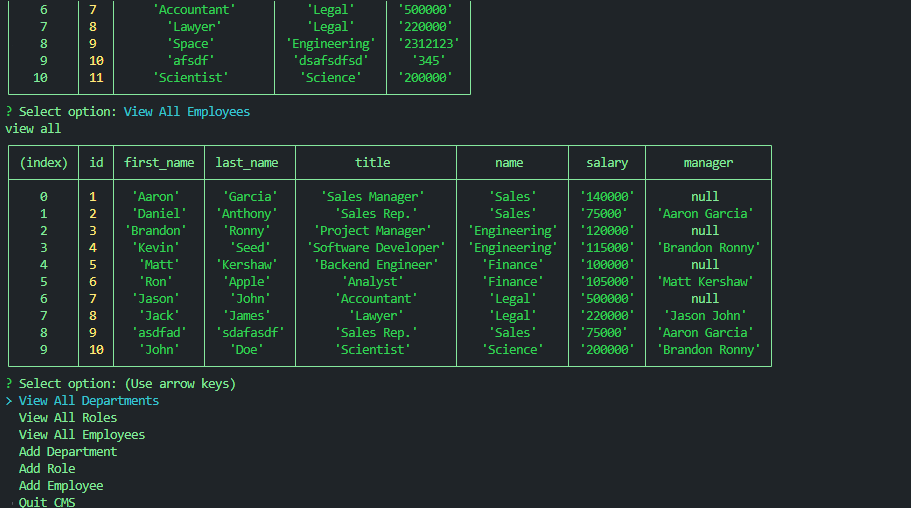

# CMS-Node.js

Command-line content management system (CMS) application to manage a company's employee database, using Node.js, Inquirer, and MySQL.

[link to video walkthough](https://drive.google.com/file/d/1E3sxh0O4qK99ihlXC8bdymzPtnvaKXpm/view)



## Description

This web application allows users to view all employees, roles, and departments. The Node app is deployed on Heroku.

- [x] Users can add an employee.
- [x] Users can view all employees
- [x] Users can view all departments
- [x] Users can view all roles

### Usage

To use this web app, install the dependencies, then run node index.js

User will then be selected to choose different prompt options.

### Installation

Clone repo to local machine then cd into directory

```
cd CMS-Node.js/
```

Install dependencies

```
npm install
```

Start server

```
nodemon index.js
```

### Credits

N/A

### License

MIT License
